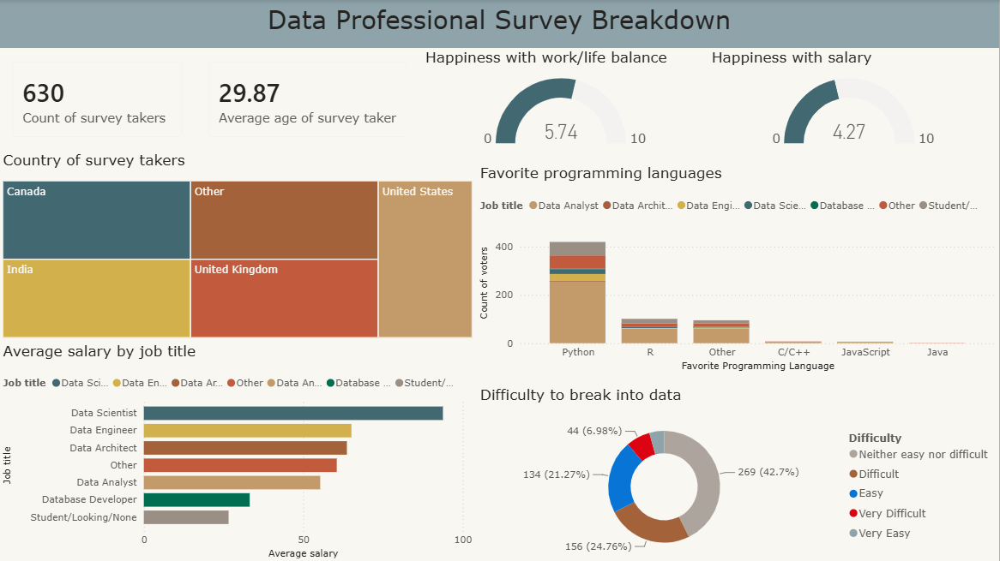

# Data professional survey dashboard
## Overview

This project presents an interactive Power BI dashboard analyzing survey responses from data professionals. The dashboard explores demographics, job roles, salary, programming language preferences, work-life balance, and the perceived difficulty of entering the data field.

## Dashboard Highlights

- Total survey participants
- Average age of respondents
- Happiness with work/life balance
- Happiness with salary
- Survey participants by country
- Favorite programming languages
- Average salary by job title
- Difficulty of breaking into the data field

## Tools Used

- Microsoft Power BI
- Data Visualization
- Data Analysis
- Dashboard Design

## Dashboard Preview

